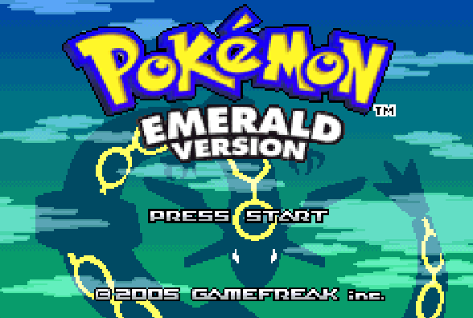

# gba_rust

## Web demo (preferred way of using this emulator)
https://zhiz-m.github.io/gba_rust/

## Pre-requisites:
This emulator requires a copy of the GBA bios. It shouldn't be hard to find online, but for legal reasons it can't be included in this repo. For the native desktop version, create an environment variable named `GBA_RUST_BIOS_PATH` with the path to the bios file. For the web version, there will be an button to upload the bios file.  

## How to run natively on your desktop:

The desktop version has the advantage of running closer to your hardware, and hence runs at a 2-3x higher uncapped FPS over the web version (though both versions can play everything I've tested comfortably at the GBA's native 60FPS)

`$ cargo run --release -- --help`

Eg, to run a game on my local setup:

`cargo run --release -- -o ..\..\Games\GBA\Pokemon_emerald.gba`

## Screenshots

## Acknowledgements:

### Reference materials

#### General reference materials
- http://www.problemkaputt.de/gbatek.htm
- https://www.coranac.com/tonc/text/toc.htm

#### ARM7TDMI CPU
- https://www.dwedit.org/files/ARM7TDMI.pdf
- https://www.intel.com/content/dam/www/programmable/us/en/pdfs/literature/third-party/archives/ddi0100e_arm_arm.pdf

#### Audio processing unit
- http://belogic.com/gba/

### Test roms
- https://github.com/jsmolka/gba-tests/tree/3fc2dc019f91180585c7f71d1d68c271baa331fe
- https://github.com/shonumi/Emu-Docs/tree/master/GameBoy%20Advance/test_roms/arm_wrestler

## Notes

The code quality could be improved, but the emulation is fully functional and great effort has been made to optimize performance- hold down your spacebar to run the emulator at an uncapped framerate. 